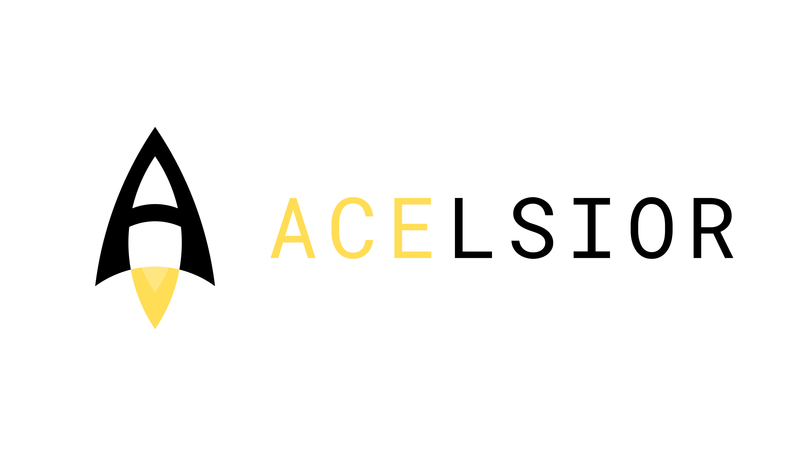

acelsior logo
-------------
Logo for the Acelsior IPSC team
	 
Reproduce
=========
Use golden ratio as follows

.. image:: ./acelsior_logo_with_golden_ratio_guides.png
	 :width: 1024
	 :alt: acelsior_logo_with_golden_ratio_guides.png

Note: Small circle below the small flame is not part of the golden ratio
circles. It's radius is the second largest square divided by 1.618 four times.

Logo centered at midpoint of width divided by 1.618 2 times
Text centered at top of width divided by 1.618 1 time.

- Canvas size: 1280 x 720
- Text size: 100 px 
- Font: RobotoMono Nerd Font Mono
- Color:
	- Rocket body and black text: Black #000000
	- Big flame and "ACE": #FFDD55
	- Small flame: #FFE680 
